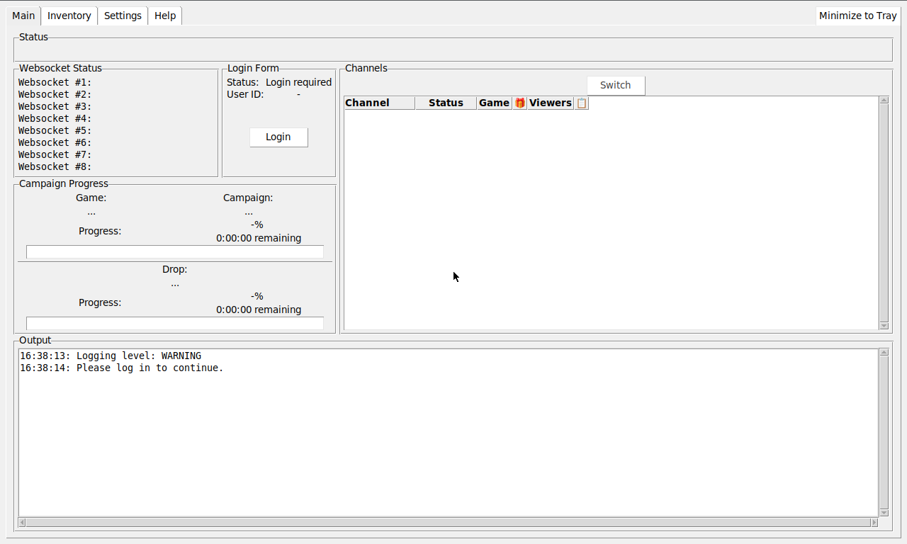

# TwitchDropsMiner-Web

[Twitch Drops Miner][tdm] in a Docker container, with its window served to your
web browser. No VM, no desktop, no X server on the host — just a container that
keeps mining 24/7 and a tab you open when you want to look at it.

The image ships the official Linux build published by [DevilXD][tdm] and runs it
on a virtual screen that is streamed to the browser over [noVNC][novnc]. Nothing
is downloaded when a container starts. The GUI plumbing is provided by
[jlesage/baseimage-gui][baseimage].



## Quick start

```sh
docker run -d \
    --name twitch-drops-miner \
    --restart unless-stopped \
    -p 5800:5800 \
    -v /docker/appdata/twitch-drops-miner:/config \
    -e TZ=Europe/Berlin \
    ghcr.io/dermute/twitchdropsminer-web:latest
```

Then open <http://localhost:5800> (or `http://<your-nas>:5800`).

Or with Docker Compose — see [`docker-compose.yml`](docker-compose.yml):

```sh
docker compose up -d
```

## Logging in

The miner logs in with Twitch's device code flow, so no browser is needed inside
the container:

1. Open the web interface. The login tab shows a link and an 8 character code.
2. On any device, go to <https://www.twitch.tv/activate> and enter the code.
3. The miner picks up the session and starts fetching campaigns.

The session is stored in `cookies.jar` inside your `/config` volume, so this is
a one-time step.

> [!CAUTION]
> `cookies.jar` grants access to your Twitch account without a password. Treat
> the `/config` volume — and any backup of it — as a secret.

> [!TIP]
> Link your Twitch account to the game accounts on the
> [campaigns page](https://www.twitch.tv/drops/campaigns), otherwise most
> campaigns cannot be mined.

## Where your data lives

Everything the miner writes is inside the `/config` volume:

| Path                      | Contents                                        |
| ------------------------- | ----------------------------------------------- |
| `/config/app/`            | The miner itself, plus all files it creates      |
| `/config/app/settings.json` | Priority list, mining mode, all GUI settings   |
| `/config/app/cookies.jar` | Twitch login session                             |
| `/config/app/cache/`      | Cached campaign and game data                    |
| `/config/app/log.txt`     | Runtime log, only written when `TDM_ARGS` has `--log` |
| `/config/xdg/`            | XDG directories of the container user            |

The miner stores its files next to its own executable, so the executable has to
live in the volume. It is not downloaded there: the image carries it in
`/opt/tdm/app`, and each start copies it into `/config/app` if what is there
does not match the image. Everything the miner itself created is left alone, so
settings and the login survive both restarts and image updates.

## Staying up-to-date

The image is self-contained — miner included — and nothing is downloaded when a
container starts. Updating the miner therefore means pulling a new image:

```sh
docker compose pull && docker compose up -d
```

A workflow checks upstream's rolling `dev-build` release once a day and only
builds when the release actually changed, so a new image usually appears within
a day of DevilXD publishing one — and no image is published on the days nothing
happened. There is also a rebuild every Monday, which changes no miner but picks
up Ubuntu security updates.

Which upstream build an image carries is recorded on the image itself, and is
what the daily check compares against:

```sh
docker image inspect ghcr.io/dermute/twitchdropsminer-web:latest \
    --format '{{ index .Config.Labels "io.github.dermute.tdm.upstream-build-id" }}'
```

Once pulled, the new build replaces the one in your volume on the next start.
Mining resumes right after — progress lives on Twitch's side, not in the
container.

To build ahead of the schedule, trigger the workflow by hand from the Actions
tab; it runs the same check, and ticking **force** builds even when upstream has
not moved.

## Configuration

### This image

| Variable            | Default       | Description                                                                                   |
| ------------------- | ------------- | --------------------------------------------------------------------------------------------- |
| `TDM_ARGS`          | `-v`          | Arguments for the miner. `-v` reports warnings, `-vv` info, `-vvvv` debug; `--log` also writes `log.txt`. |
| `TDM_RESTART_DELAY` | `300`         | Seconds to wait before restarting after the miner failed.                                      |
| `TDM_DATA_DIR`      | `/config/app` | Where the miner is installed.                                                                  |

### Base image

The most useful ones — the base image supports
[many more][baseimage-env]:

| Variable                       | Default    | Description                                                        |
| ------------------------------ | ---------- | ------------------------------------------------------------------ |
| `USER_ID` / `GROUP_ID`         | `1000`     | Owner of the files in `/config`.                                    |
| `TZ`                           | `Etc/UTC`  | Timezone, affects the timestamps shown by the miner.                |
| `DISPLAY_WIDTH` / `DISPLAY_HEIGHT` | `1920` / `1080` | Size of the virtual screen. `1280x768` is plenty for the miner. |
| `WEB_AUTHENTICATION`           | `0`        | Put a login in front of the web interface.                          |
| `WEB_AUTHENTICATION_USERNAME` / `WEB_AUTHENTICATION_PASSWORD` | | Credentials for it. |
| `SECURE_CONNECTION`            | `0`        | Serve the web interface over HTTPS.                                 |
| `VNC_PASSWORD`                 | (unset)    | Password for VNC clients on port 5900.                              |
| `KEEP_APP_RUNNING`             | `1`        | Restart the miner when it exits. Set to `0` to stop the container instead. |
| `DARK_MODE`                    | `0`        | Dark GTK/Qt theme. The miner draws its own Tk widgets, so this changes little. |

### Ports

| Port | Description                                            |
| ---- | ------------------------------------------------------ |
| 5800 | Web interface. This is the one you want.               |
| 5900 | Raw VNC, for a native client. Not published by default. |

## Notes

- **Only one container per volume.** The miner takes a lock on its directory and
  exits with code 3 if a second instance uses the same `/config`.
- **Use local storage for `/config`.** The lock relies on `fcntl` locking, which
  is unreliable on NFS and SMB mounts — a common trap on a NAS. A local Docker
  volume or a directory on local disk is fine.
- **Do not watch Twitch on the mining account.** Upstream warns that watching a
  stream in a browser with the same account confuses the drop progression.
- **Do not expose port 5800 to the internet as-is.** Anyone who reaches it
  controls a browser-visible session that is logged into your Twitch account. Use
  `WEB_AUTHENTICATION`, a reverse proxy with authentication, or a VPN.
- **CAPTCHA.** If Twitch asks for a CAPTCHA during login, the miner exits with
  code 1. The container waits `TDM_RESTART_DELAY` seconds and tries again rather
  than looping; log in again through the web interface when that happens.

## Architectures

`linux/amd64` and `linux/arm64`, matching the `x86_64` and `aarch64` builds
upstream publishes.

## Building it yourself

```sh
docker build -t twitchdropsminer-web .
```

The build downloads the miner from the upstream release and copies it into the
image, in a stage of its own — that download is the only network access the
build needs beyond the base image.

Useful build arguments:

- `TDM_RELEASE_TAG` — upstream release to take the miner from. Default
  `dev-build`.
- `TDM_BUILD_ID` — an arbitrary string identifying the upstream build. Change it
  to stop a rebuild from reusing the cached download layer; the workflow sets it
  to the current upstream asset ids.
- `BASEIMAGE_VERSION` — tag of `jlesage/baseimage-gui` to build on.
- `DOCKER_IMAGE_VERSION` / `TDM_VERSION` — version strings for the image labels
  and the title bar.

## Troubleshooting

**The web interface is up but the window is empty.** The miner is probably
restarting. Check `docker logs twitch-drops-miner`.

**The miner is older than the one in the image.** The volume is only synced at
start, so restart the container after pulling a new image.

**Reset everything.** Stop the container and delete the `/config` volume. The
next start reinstalls the miner and asks you to log in again.

## What this repository actually contains

A Dockerfile, three shell scripts, and a favicon. The only thing taken from the
upstream project is the release asset
`Twitch.Drops.Miner.Linux.PyInstaller-<arch>.zip` — a single executable and its
`manual.txt` — which the build downloads unmodified from the `dev-build` release
and copies into the image. The favicon is converted from the upstream
`icons/pickaxe.ico`.

## Credits

- [DevilXD/TwitchDropsMiner][tdm] — the actual miner. This repository only
  packages it; all mining logic, the GUI, and the icon are theirs.
- [jlesage/docker-baseimage-gui][baseimage] — the X server, noVNC and supervisor
  plumbing that make the GUI reachable from a browser.

## AI attribution

This project was developed with AI assistance.

<div style="display: flex; align-items: center; white-space: nowrap; gap: 0.5rem; padding: 8px;">
  <div style="font-family: IBM Plex Sans; font-weight: 400; font-size: 16px; line-height: 22px; letter-spacing: 0px;">
    <a rel="noopener noreferrer" href="https://aiattribution.github.io/statements/AIA-EAI-Hin-Nr-?model=Opus%205-v1.0" data-cy="recommended-attribution-statement-text" target="_blank" style="font-family: IBM Plex Sans; font-weight: 400; font-size: 16px; line-height: 22px; letter-spacing: 0px;">AIA EAI Hin Nr Opus 5 v1.0 </a>
  </div>
  <div style="display: flex; gap: 0.5rem;">
    <svg width="24" height="24" viewBox="0 0 24 24" fill="none" xmlns="http://www.w3.org/2000/svg">
      <g clip-path="url(#clip0_50_2)">
        <path d="M12 23.5C18.3513 23.5 23.5 18.3513 23.5 12C23.5 5.64873 18.3513 0.5 12 0.5C5.64873 0.5 0.5 5.64873 0.5 12C0.5 18.3513 5.64873 23.5 12 23.5Z" fill="#4E4E4E" stroke="#161616">
        </path>
        <path d="M13.6471 15.6L13.1471 13.94H10.8171L10.3171 15.6H8.77715L11.0771 8.61998H12.9571L15.2271 15.6H13.6471ZM11.9971 9.99998H11.9471L11.1771 12.65H12.7771L11.9971 9.99998Z" fill="white">
        </path>
      </g>
      <defs>
        <clipPath id="clip0_50_2">
          <rect width="24" height="24" fill="white">
          </rect>
        </clipPath>
      </defs>
    </svg>
    <svg width="24" height="24" viewBox="0 0 24 24" fill="none" xmlns="http://www.w3.org/2000/svg">
      <path d="M18 17H16.5V16H18V8H16.5V7H18C18.2651 7.0003 18.5193 7.10576 18.7068 7.29323C18.8942 7.4807 18.9997 7.73488 19 8V16C18.9996 16.2651 18.8942 16.5193 18.7067 16.7067C18.5193 16.8942 18.2651 16.9996 18 17Z" fill="#161616">
      </path>
      <path d="M15.5 13C16.0523 13 16.5 12.5523 16.5 12C16.5 11.4477 16.0523 11 15.5 11C14.9477 11 14.5 11.4477 14.5 12C14.5 12.5523 14.9477 13 15.5 13Z" fill="#161616">
      </path>
      <path d="M12 13C12.5523 13 13 12.5523 13 12C13 11.4477 12.5523 11 12 11C11.4477 11 11 11.4477 11 12C11 12.5523 11.4477 13 12 13Z" fill="#161616">
      </path>
      <path d="M8.5 13C9.05228 13 9.5 12.5523 9.5 12C9.5 11.4477 9.05228 11 8.5 11C7.94772 11 7.5 11.4477 7.5 12C7.5 12.5523 7.94772 13 8.5 13Z" fill="#161616">
      </path>
      <path d="M7.5 17H6C5.73488 16.9997 5.4807 16.8942 5.29323 16.7068C5.10576 16.5193 5.0003 16.2651 5 16V8C5.00026 7.73486 5.10571 7.48066 5.29319 7.29319C5.48066 7.10571 5.73486 7.00026 6 7H7.5V8H6V16H7.5V17Z" fill="#161616">
      </path>
      <circle cx="12" cy="12" r="11.5" stroke="#161616">
      </circle>
      <circle cx="12" cy="12" r="11.5" stroke="#161616">
      </circle>
    </svg>
    <svg width="24" height="24" viewBox="0 0 24 24" fill="none" xmlns="http://www.w3.org/2000/svg">
      <circle cx="12" cy="12" r="11.5" stroke="#161616">
      </circle>
      <path d="M10 6C10.4945 6 10.9778 6.14662 11.3889 6.42133C11.8 6.69603 12.1205 7.08648 12.3097 7.54329C12.4989 8.00011 12.5484 8.50277 12.452 8.98773C12.3555 9.47268 12.1174 9.91814 11.7678 10.2678C11.4181 10.6174 10.9727 10.8555 10.4877 10.952C10.0028 11.0484 9.50011 10.9989 9.04329 10.8097C8.58648 10.6205 8.19603 10.3 7.92133 9.88893C7.64662 9.4778 7.5 8.99445 7.5 8.5C7.5 7.83696 7.76339 7.20107 8.23223 6.73223C8.70107 6.26339 9.33696 6 10 6ZM10 5C9.30777 5 8.63108 5.20527 8.0555 5.58986C7.47993 5.97444 7.03133 6.52107 6.76642 7.16061C6.50151 7.80015 6.4322 8.50388 6.56725 9.18282C6.7023 9.86175 7.03564 10.4854 7.52513 10.9749C8.01461 11.4644 8.63825 11.7977 9.31718 11.9327C9.99612 12.0678 10.6999 11.9985 11.3394 11.7336C11.9789 11.4687 12.5256 11.0201 12.9101 10.4445C13.2947 9.86892 13.5 9.19223 13.5 8.5C13.5 7.57174 13.1313 6.6815 12.4749 6.02513C11.8185 5.36875 10.9283 5 10 5Z" fill="#161616">
      </path>
      <path d="M15 19H14V16.5C14 15.837 13.7366 15.2011 13.2678 14.7322C12.7989 14.2634 12.163 14 11.5 14H8.5C7.83696 14 7.20107 14.2634 6.73223 14.7322C6.26339 15.2011 6 15.837 6 16.5V19H5V16.5C5 15.5717 5.36875 14.6815 6.02513 14.0251C6.6815 13.3687 7.57174 13 8.5 13H11.5C12.4283 13 13.3185 13.3687 13.9749 14.0251C14.6313 14.6815 15 15.5717 15 16.5V19Z" fill="#161616">
      </path>
      <path d="M19.9592 9.99025L19.3932 9.42432L17.938 10.8796L16.4827 9.42432L15.9167 9.99025L17.372 11.4455L15.9167 12.9008L16.4827 13.4667L17.938 12.0115L19.3932 13.4667L19.9592 12.9008L18.5039 11.4455L19.9592 9.99025Z" fill="#161616">
      </path>
    </svg>
  </div>
</div>

## License

The contents of this repository are released under the [MIT license](LICENSE).
Twitch Drops Miner itself is distributed under its own
[MIT license](https://github.com/DevilXD/TwitchDropsMiner/blob/master/LICENSE)
and is redistributed here unmodified, exactly as published upstream.

This project is not affiliated with Twitch, DevilXD, or jlesage.

[tdm]: https://github.com/DevilXD/TwitchDropsMiner
[baseimage]: https://github.com/jlesage/docker-baseimage-gui
[baseimage-env]: https://github.com/jlesage/docker-baseimage-gui#environment-variables
[novnc]: https://github.com/novnc/noVNC
